# IMDB Top 100 Films — Data Cleaning & Exploratory Analysis

An end-to-end data analysis project: taking a deliberately corrupted IMDB
dataset from raw, unusable text to a validated, analysis-ready table, then
using it to answer eight analytical questions about what drives a film's
rating, revenue, and reputation.

**Tools:** Python · pandas · NumPy · Matplotlib · seaborn · Jupyter

**Deliverables:**
- [`imdb_cleaning.ipynb`](imdb_cleaning.ipynb) — the full cleaning pipeline
- [`imdb_analysis.ipynb`](imdb_analysis.ipynb) — exploratory analysis & visualisations
- [`data/clean_imdb.csv`](data/clean_imdb.csv) — the validated output dataset
- [`figures/`](figures/) — all generated charts

---

## 1. Project Overview

The source file, `messy_IMDB_dataset.csv`, contains 100 highly-rated films
spanning **1937 – 2020**, with fields for title, release date, genre,
runtime, country, content rating, director, box-office income, vote count,
and IMDB score. It arrived in a badly damaged state — inconsistent
encodings, multiple date formats, and numeric columns riddled with
formatting garbage — none of which could be analysed as delivered.

The project has two halves. The first is a **rigorous cleaning pipeline**
that repairs every column while documenting each judgment call. The second
is an **exploratory analysis** that treats the cleaned data as trustworthy
and investigates the relationships between a film's characteristics and its
success.

A guiding caveat runs through the entire analysis: **this is a curated list
of already-acclaimed films, not a random sample of cinema.** Every finding
below describes patterns *among top films*, and cannot be generalised to
movies as a whole.

---

## 2. Data Cleaning

The raw file failed to load as a normal CSV. It used **semicolons** as
delimiters and a non-UTF-8 (`latin-1`) encoding, with corrupted characters
scattered through the headers and text fields. Once parsed, a structured
audit — a column-by-column *damage report* — catalogued every defect before
any repair began.

### 2.1 Structural issues

| Problem | Resolution |
|---|---|
| Semicolon delimiter, `latin-1` encoding | Correct `sep`/`encoding` on load |
| Corrupted, inconsistent column names (`IMBD title ID`, `Original titl�`) | Renamed all columns to clean `snake_case` |
| A phantom, fully-empty unnamed column | Verified 100% null, then dropped |
| One completely blank row | Removed via `dropna(how='all')` |
| Duplicate rows | Checked — none found |

### 2.2 Column-by-column repair

Each numeric and categorical field was repaired individually. The most
instructive cases:

- **`income`** — values carried `$` prefixes, spaces, and thousands commas.
  One entry, *The Godfather: Part II*, contained the letter **`o`
  masquerading as a zero** (`4o8,035,783`). Naïvely stripping non-digits
  would have *deleted* that character and silently recorded the film's
  income as ~$48M instead of ~$408M — a 10× error. The fix translated the
  `o` to `0` **before** stripping. A separate implausible value —
  *12 Angry Men* listed at **$576** — was verified against IMDB and
  corrected.

- **`score`** — the most corrupted column, containing values such as
  `9,.0`, `8..8`, `08.9`, `8:8`, `++8.7`, and `8,9f`. Several of these were
  European-style decimals in disguise (`8,9` = 8.9; `8:8` = 8.8). Blindly
  stripping punctuation would have welded `8,9` into `89`. The fix
  **translated commas and colons to decimal points first**, then removed
  remaining junk, collapsed duplicate points, and finally **range-validated
  every value to 0–10**.

- **`release_year`** — dates appeared in four-plus formats
  (`1995-02-10`, `09 21 1972`, `22 Feb 04`, `23rd December of 1966`).
  A forgiving parser handled the majority; three impossible survivors
  (e.g. month `13`, day `34`) were hand-corrected by extracting the valid
  year. A validation check then caught *Casablanca* parsed as **year 2046**
  — a two-digit-century error (`46` read as 2046) — which was corrected to
  its true release year.

- **`votes`** — dot-based thousands separators (`2.278.845`) removed, then
  cast to integer.

- **`duration`** — junk like `178c`, `Nan`, `Inf`, and blanks coerced to
  proper `NaN`; missing values imputed with the column **median** (robust to
  the long-runtime outliers).

- **`country`** — spelling variants and typos unified with a mapping
  (`US`/`US.` → `USA`; `New Zesland`/`New Zeland` → `New Zealand`;
  `Italy1` → `Italy`).

- **`content_rating`** — `Not Rated`/`Unrated` merged; 23 missing values
  assigned an explicit **`Unknown`** category rather than dropped.

### 2.3 Validation & output

Before saving, a cell of `assert` statements formally verified every
cleaning guarantee — correct dtypes, `score` within 0–10, `year` within a
sane range, and no unexpected nulls. The raw file dropped from **101 rows to
100** (one blank row removed). The result was written to
[`data/clean_imdb.csv`](data/clean_imdb.csv), which every analysis step
reads from — cleaning and analysis are kept strictly separate.

---

## 3. The Cleaned Dataset

The final dataset holds **100 films × 11 columns** with zero missing values
and correct data types:

| Column | Type | Description |
|---|---|---|
| `title_id`, `original_title`, `director` | text | Identifiers |
| `genre`, `country`, `content_rating` | categorical | Multi-value `genre` |
| `year` | integer | Release year (1937–2020) |
| `duration` | float | Runtime in minutes (81–229) |
| `income` | integer | Box-office income (USD) |
| `votes` | integer | IMDB vote count |
| `score` | float | IMDB rating (7.4–9.3) |

---

## 4. Exploratory Data Analysis

### 4.1 Numerical columns

| Column | Key statistics | Distribution shape |
|---|---|---|
| **Score** | 7.4 – 9.3, mean 8.24 | Very narrow band — every film is highly rated |
| **Duration** | 81 – 229 min, mean 135 | Roughly normal, right tail of long epics |
| **Income** | $73K – $2.8B, mean $299M, median $109M | Strongly right-skewed (mean ≫ median) |
| **Votes** | up to ~2.28M, mean ~830K | Right-skewed toward a few mega-popular films |
| **Year** | 1937 – 2020 | Concentrated in the 1990s–2000s |

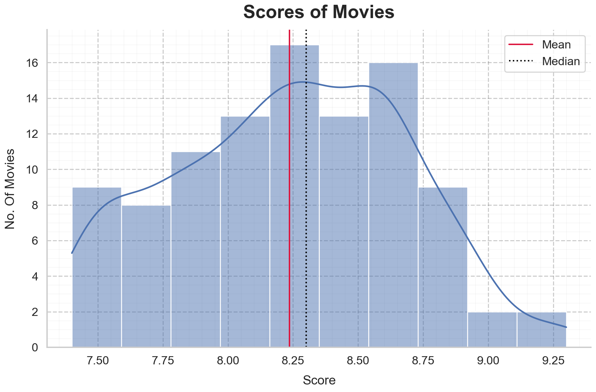 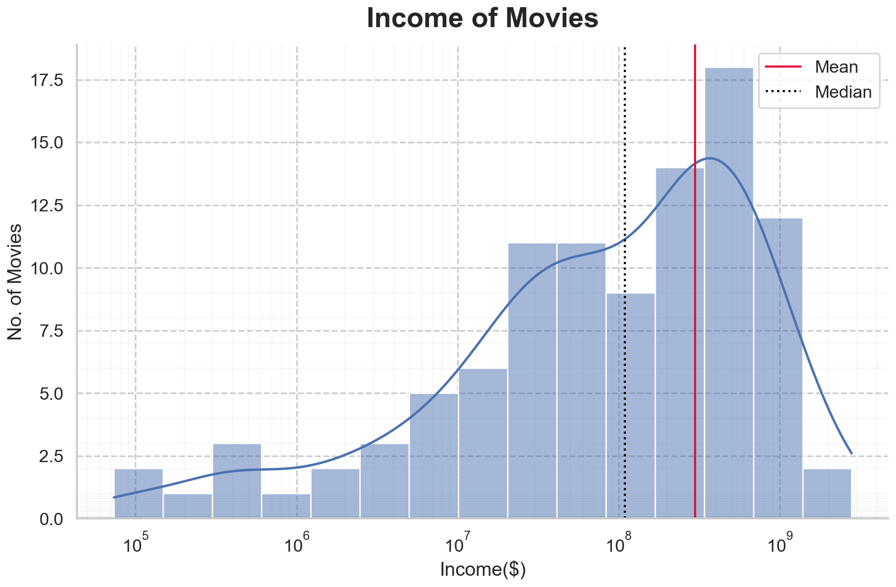

The single most important observation is the **narrow score range**. With
all films rated between 7.4 and 9.3, there is very little variation for any
factor to "explain" — a condition known as *range restriction* that
deflates every correlation involving score, and which must be kept in mind
throughout.

Income tells the opposite story: it spans **four orders of magnitude**, from
a $73K art-house film to *Avengers: Endgame* at $2.8B, making the mean
nearly three times the median.

### 4.2 Categorical columns

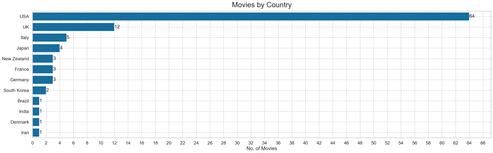 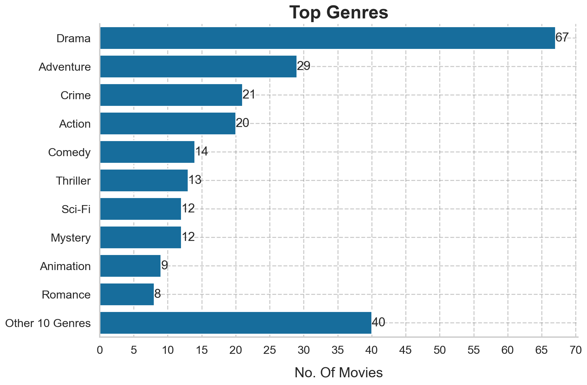

- **Country** — dominated by the **USA (64 films)**, followed by the UK (12),
  with a long tail of single-film countries. This concentration means most
  cross-country comparisons collapse to "Hollywood vs. the rest."
- **Genre** — after splitting and exploding multi-genre entries (100 films →
  245 genre-rows across 20 genres), **Drama dominates**, appearing in a
  majority of films; Adventure, Crime, and Action follow.
- **Content rating** — **R (45)** is most common; the imputed **Unknown
  (23)** category is the second largest and is flagged wherever it appears.
- **Directors** — 64 unique directors, of whom **19 have more than one film**
  on the list, together accounting for 55 of the 100 films.

---

## 5. Analytical Questions

### Correlation Overview

Before individual questions, a correlation heatmap of all numeric columns
mapped the terrain. The **strongest** relationship is between **votes and
score** (r = 0.67); the **weakest** are between **year and duration** and
duration and score. This overview directed the questions that follow.

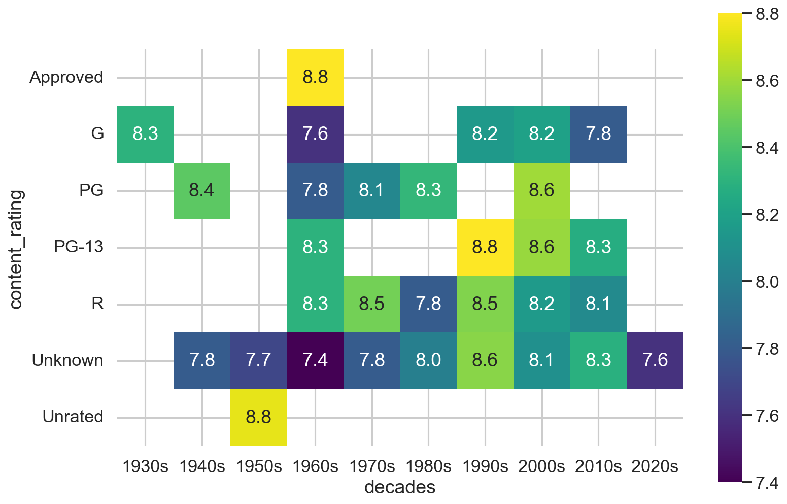

---

### Q1 — Do longer films score higher?

**Significance.** A common assumption holds that longer, "epic" films are
more prestigious and better-regarded. This tests whether runtime actually
predicts rating.

**Findings.** Duration and score show only a **weak positive correlation
(r = 0.19)**. The scatter plot reveals no strong trend, with three outlier
films of exceptionally long runtime (led by *Once Upon a Time in America* at
229 minutes).

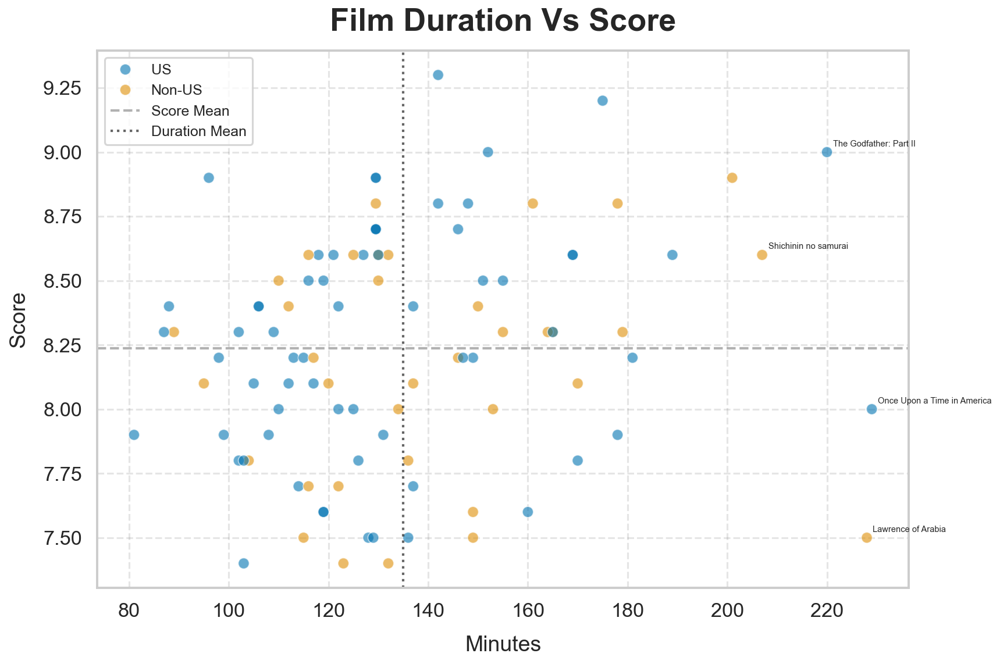

**Interpretation.** Runtime is **not a meaningful predictor of quality**
within this dataset — the "longer = better" assumption is not supported.
This weak result is also partly a product of the narrow score range: with
so little variation in score to begin with, no single factor can explain
much of it.

---

### Q2 — Does popularity track quality? (votes vs. score)

**Significance.** Vote count is a proxy for popularity and visibility. Do the
most-voted films also score highest — and if so, why?

**Findings.** Votes and score show the **strongest relationship in the
dataset (r = 0.67)**, meaning vote count statistically accounts for roughly
**45% of the variation** in score (r²). *The Shawshank Redemption* and *The
Dark Knight* stand out as the most-voted films.

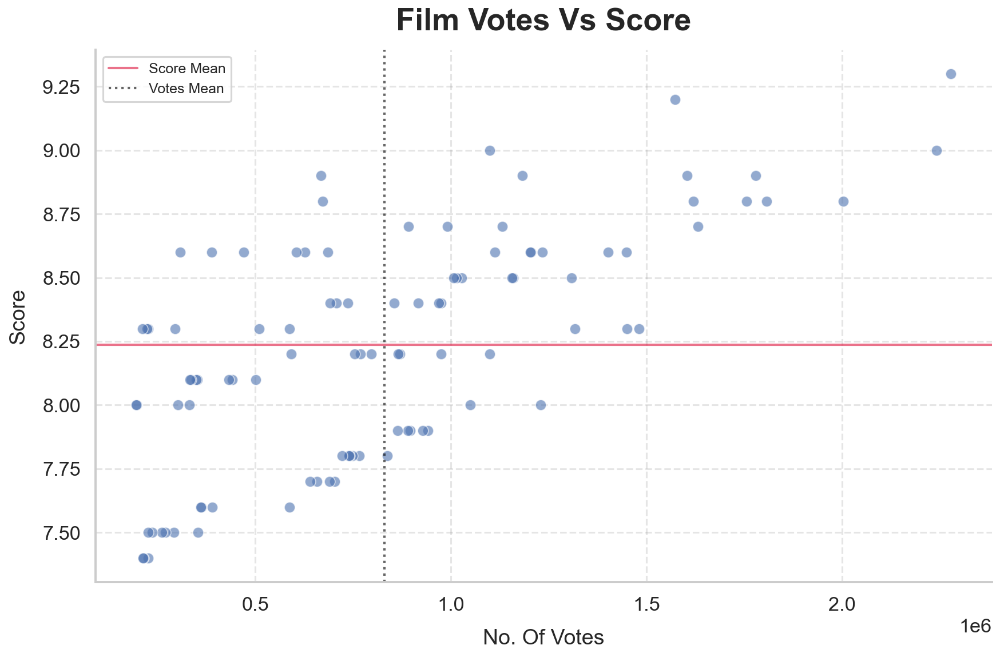

**Interpretation.** Two explanations are equally plausible, and this data
**cannot distinguish between them**: (1) audiences who love a film are more
likely to rate it, so quality drives votes; or (2) heavily-voted films rank
higher on IMDB, gain visibility, and attract still more votes. The
relationship is real and strong, but its *direction* is genuinely ambiguous.

---

### Q3 — Which decade produced the highest-rated films?

**Significance.** Tests the nostalgia hypothesis — that films from a
particular era are held in higher regard.

**Findings.** The **1990s** had the highest average score *and* the
second-largest number of films (20), making it a well-supported result. The
1930s and 2020s posted extreme averages (8.3 and 7.6) but each contain only
**a single film**, so their averages are statistically meaningless.

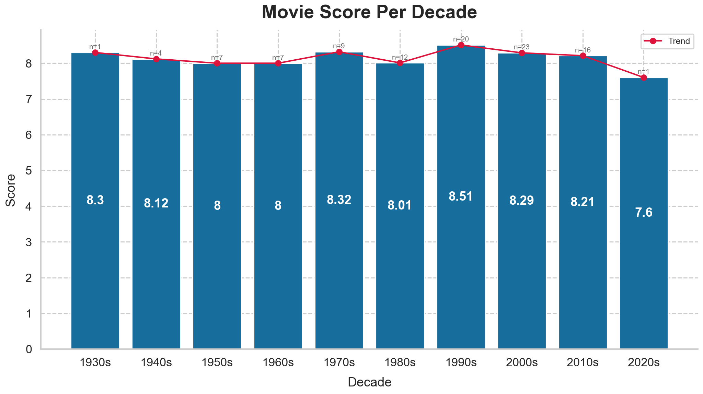

**Interpretation.** The 1990s stand out as the strongest decade among these
top films — but the finding is really "*the 1990s films that made this list*
scored highest," not a claim about all cinema of the era. Sample size per
decade must always accompany the averages.

---

### Q4 — Which genres score best, and which earn most — do the rankings agree?

**Significance.** Reveals whether critical acclaim and commercial success
align across genres, or pull in different directions.

**Findings.**
- **Action** ranked highest in *both* average score and average income.
- **Sci-Fi** and **Fantasy** appear in the top 5 of both rankings.
- The rankings diverge sharply elsewhere: **Animation** was the 3rd
  highest-scoring genre but only 8th in earnings, while **Crime** was 3rd in
  score yet 8th in income. **Adventure** was 6th in score but 2nd in earnings.

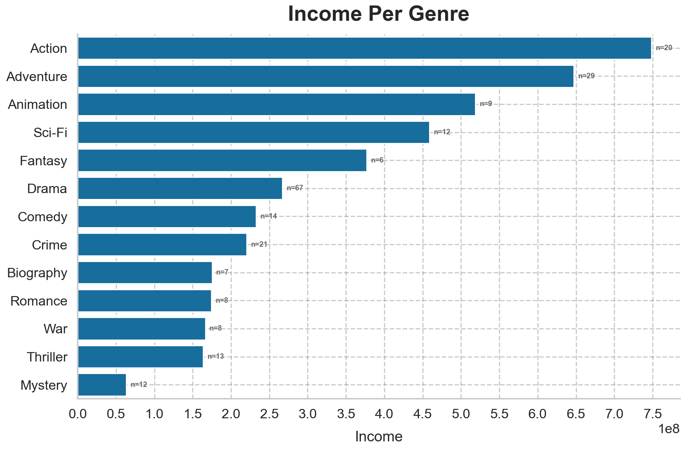

**Interpretation.** For some genres, quality and revenue align (Action,
Sci-Fi); for others, they clearly **do not** — prestige genres like Animation
and Crime are acclaimed without topping the box office, while Adventure
earns more than its ratings alone would suggest. *(Income figures use the
**mean** per genre; sums are avoided because multi-genre films would be
double-counted in the exploded data.)*

---

### Q5 — Which genre is most revenue-efficient per minute of runtime?

**Significance.** Moves beyond raw earnings to a derived efficiency metric —
income generated per minute of film — asking which genres deliver the most
commercial value for their length.

**Findings.** **Animation, Action, and Adventure** are the most
revenue-efficient per minute of runtime, by a clear margin over other genres.

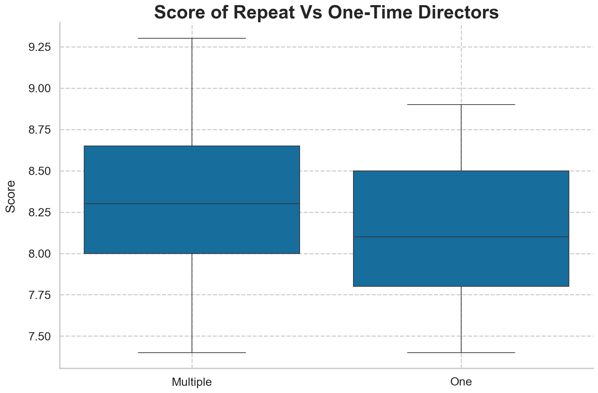

**Interpretation.** These are the "spectacle" genres — typically shorter,
broadly commercial, and often franchise-driven — that convert runtime into
box office most effectively. Notably, Animation ranks highly here despite its
modest *total* earnings, a nuance that only a per-minute view reveals.

---

### Q6 — Do repeat directors outperform one-film directors?

**Significance.** Tests whether directors with multiple acclaimed films
(potential "auteurs") produce higher-rated work than one-time entrants.

**Findings.** The split is fairly even — **55 films by repeat directors, 45
by one-time directors.** Repeat directors scored marginally higher: a mean
and median of **8.3**, versus **8.1** for one-time directors.

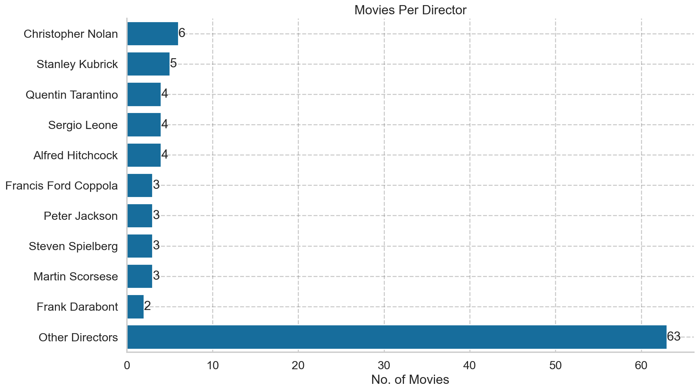

**Interpretation.** The difference is small and comes with a strong
selection-bias caveat: on a top-100 list, "repeat director" largely means
"famous enough that two or more of their films were included." The gap likely
reflects **reputation and selection, not measurably superior directing
skill.**

---

## 6. Conclusion

This project took a genuinely broken dataset — wrong delimiter, corrupted
encoding, multiple silent numeric corruptions, and inconsistent date formats
— and transformed it into a validated, fully-typed, analysis-ready table
through a documented, reproducible pipeline. The cleaning phase alone
surfaced several traps (a letter impersonating a digit, decimals disguised as
punctuation, a film mis-dated to the future) that would each have quietly
poisoned the conclusions had they gone uncaught.

The analysis produced a consistent picture of what distinguishes films on
this top-100 list:

- **Popularity is the strongest correlate of score** (r = 0.67), though cause
  and effect cannot be separated.
- **Runtime does not predict quality** — the "longer epics are better"
  assumption is unsupported.
- **The 1990s** stand out as the strongest era among these films.
- **Acclaim and revenue only partly align by genre** — Action wins both,
  but Animation and Crime earn critical regard without commercial dominance.
- **Spectacle genres (Animation, Action, Adventure)** are the most
  revenue-efficient per minute.
- **Repeat directors score marginally higher**, most likely due to selection
  rather than skill.

The overriding limitation is the dataset itself: **100 curated, already-great
films**, with scores compressed into a 7.4–9.3 band. Every finding describes
patterns *among elite films* and should not be generalised to cinema at
large. A natural next step would be to analyse a **larger, representative
sample** spanning the full quality spectrum — which would give factors like
runtime and genre real variation to act on, and allow these hypotheses to be
tested rather than merely observed.

---

*Data cleaning and analysis performed in Python. All figures reproducible from
the accompanying notebooks.*
